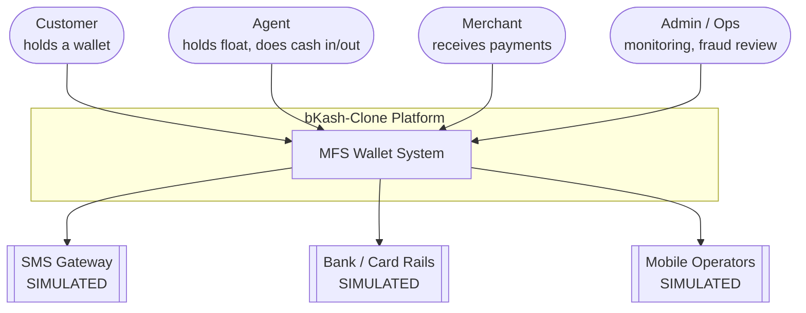
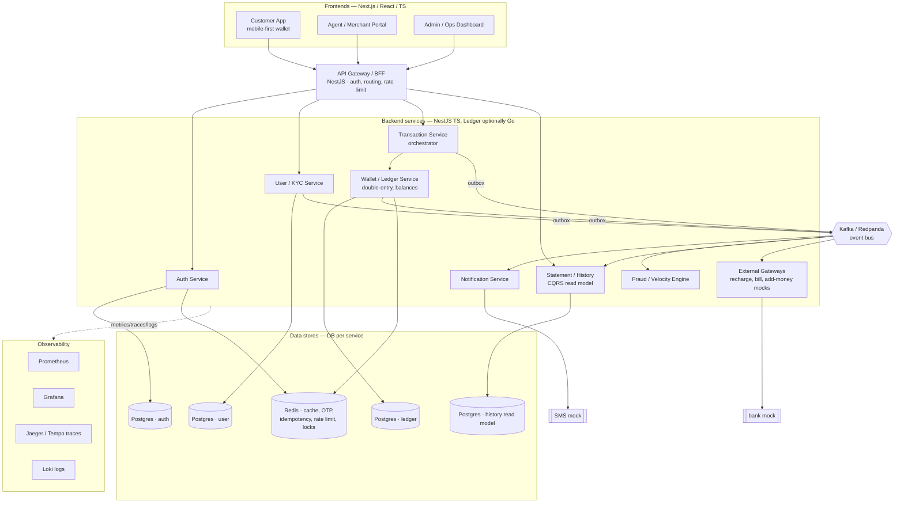
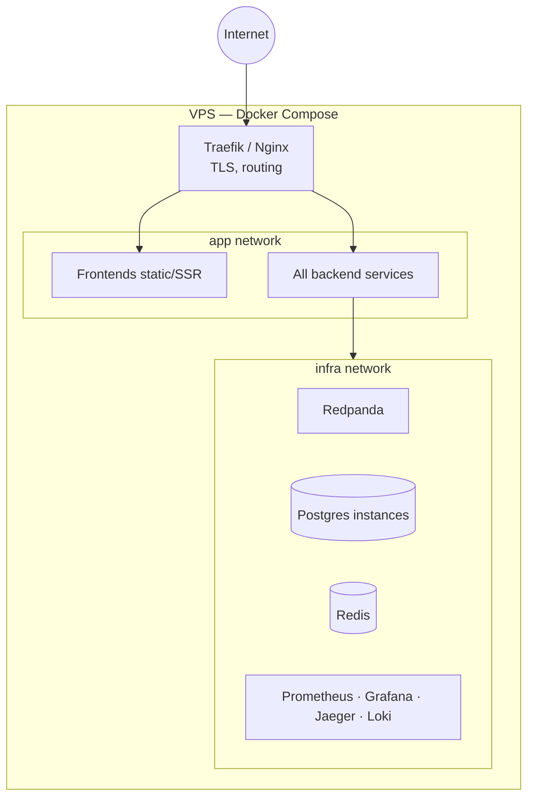

# Architecture Design Document — bKash-Clone (MFS Platform)

> **Status:** Living document · **Last updated:** 2026-07-19 · **Owner:** Niloy
>
> A closed-loop Mobile Financial Service (MFS) platform modelled on bKash, built as a
> system-design showcase. This document describes the target architecture and the
> reasoning behind it. Individual decisions are recorded as [ADRs](./adr/).

---

## 1. Purpose & context

This is a **stored-value wallet system**: users hold a balance and move money between
wallets, agents, merchants, and (simulated) external banks. It is *not* a bank — there is
no chartered deposit-taking. The engineering interest is that it is a **real-money ledger**
with roles, limits, fees, fraud controls, and reconciliation.

The system is built to demonstrate, concretely:

1. **Money correctness** — double-entry ledger, idempotency, exactly-once effects.
2. **Scale & performance** — caching, CQRS read models, per-account ordering, load-tested.
3. **Security & auth** — OTP/PIN, JWT rotation, RBAC, audit, velocity/fraud engine.
4. **Observability & ops** — metrics, tracing, structured logs, CI/CD, zero-downtime deploy.

### Non-goals

- Real banking/payment integration (all external systems are **simulated**).
- Regulatory compliance (KYC/AML is modelled structurally, not to legal standard).
- Multi-region / geo-replication (single VPS, documented as future work).

### Key constraints

| Constraint | Value | Impact |
|---|---|---|
| Team | 1 engineer | Bias to velocity; TypeScript-primary; avoid polyglot sprawl |
| Timeline | 4–6 months | Ship in phases; always demoable |
| Deployment | Single VPS, Docker Compose | No k8s; services must be Compose-friendly |
| External deps | Simulated | Mock SMS, bank, card gateway behind clean interfaces |

---

## 2. Architecture at a glance

The system is **event-driven microservices, distributed from day one** — separate services,
each with its own database, communicating over the network (sync) and via Kafka (async).
Services are added **incrementally** (topology is distributed from the start; the *pace* is
still one capability at a time — see [ADR-0001](./adr/0001-modular-monolith-to-microservices.md)).
Synchronous commands hit a command edge; side effects propagate asynchronously via Kafka.

**Core principles**

- **Write for correctness, read for scale.** The ledger is normalized and ACID; history/
  statements are denormalized read models built from events ([ADR-0005](./adr/0005-cqrs-read-models.md)).
- **No lost events, no dual-write.** State change + event publish are atomic via the
  transactional outbox ([ADR-0004](./adr/0004-transactional-outbox.md)).
- **One account's money is serialized.** Commands for a given wallet are ordered on a
  single Kafka partition ([ADR-0008](./adr/0008-per-account-ordering.md)).
- **Every mutation is idempotent.** Client-supplied idempotency keys make retries safe.

---

## 3. C4 Level 1 — System context



Four human roles, three simulated external systems. The simulated systems sit behind
adapter interfaces so a real integration could replace a mock without touching core logic.

---

## 4. C4 Level 2 — Container diagram



### Service responsibilities

| Service | Owns | Sync API | Emits events | Consumes events |
|---|---|---|---|---|
| **API Gateway / BFF** | Edge auth, routing, rate limit, request shaping | REST to clients | — | — |
| **Auth** | Credentials, OTP, PIN, JWT issue/rotate, sessions | login, otp, refresh | `UserRegistered` | — |
| **User / KYC** | Profiles, roles, KYC tier, limit config | profile, kyc | `KycTierChanged`, `LimitsUpdated` | `UserRegistered` |
| **Transaction** | Orchestrates flows (send, cash in/out, payment, add-money saga), enforces limits/fees | initiate txn | `TransferInitiated`, `TransferCompleted`, `TransferFailed` | `LedgerPosted`, `FraudHold` |
| **Wallet / Ledger** | Double-entry entries, balances, idempotency | (internal) post | `LedgerPosted` | `TransferInitiated` |
| **Fraud / Velocity** | Rule engine, holds, device/velocity checks | (internal) | `FraudHold`, `FraudCleared` | `TransferInitiated`, `LedgerPosted` |
| **Notification** | SMS/push (mock), templating | — | — | most domain events |
| **Statement / History** | Denormalized transaction history, statements | history, statement | — | `LedgerPosted`, `TransferCompleted` |
| **External Gateways** | Recharge, bill pay, add-money, bKash-to-bank mocks | — | `AddMoneyConfirmed`, `RechargeCompleted` | `AddMoneyRequested`, `RechargeRequested` |

---

## 5. C4 Level 3 — Component view of the money path

The send-money command is the canonical flow. Everything else is a variation.

```mermaid
sequenceDiagram
    participant C as Customer App
    participant GW as Gateway
    participant TX as Transaction Svc
    participant LD as Ledger Svc
    participant OB as Outbox+Relay
    participant K as Kafka
    participant HS as History (CQRS)
    participant NT as Notification

    C->>GW: POST /transfers (Idempotency-Key, PIN)
    GW->>TX: initiate transfer
    TX->>TX: check idempotency key (Redis)
    TX->>TX: enforce limits + compute fee
    TX->>LD: post double-entry (debit A, credit B, fee)
    LD->>LD: BEGIN; insert ledger_entries; update balances; insert outbox; COMMIT
    LD-->>TX: posted (txnId)
    Note over OB: relay reads outbox → publishes
    OB->>K: LedgerPosted
    K->>HS: build/append history rows
    K->>NT: send SMS (mock) to A and B
    TX-->>GW: 200 (txnId, new balance)
    GW-->>C: success
```

**Why it's shaped this way**

- The **ledger transaction is the only place money changes**, and it writes the outbox row
  in the *same* DB transaction — so an event is emitted **iff** the money moved.
- **Idempotency** is checked before any effect; a retried request returns the original result.
- **History and notifications are async** — they must never be able to fail the transfer.

---

## 6. Cross-cutting concerns

### 6.1 Money correctness
- **Double-entry ledger** ([ADR-0003](./adr/0003-double-entry-ledger.md)): append-only
  `ledger_entries`; balances materialized, never edited in place; every txn sums to zero.
- **Idempotency**: `Idempotency-Key` header → stored result; retries are safe.
- **Reconciliation job** (nightly): `Σ ledger entries per account == materialized balance`;
  drift raises an alert and appears on the admin dashboard.
- **Exactly-once effects** via per-account partition ordering + consumer dedup
  ([ADR-0008](./adr/0008-per-account-ordering.md)).

### 6.2 Scale & performance
- **Redis balance-read cache**, invalidated on `LedgerPosted`.
- **CQRS read models** for history/statements ([ADR-0005](./adr/0005-cqrs-read-models.md)).
- **Rate limiting** (token bucket in Redis) at the gateway and per-account.
- **Hot-wallet contention**: per-account serialization + short DB transactions + retry on
  serialization failure. Load-tested with k6; p99/throughput published in `docs/perf/`.

### 6.3 Security & auth
- **Registration/login**: OTP (mock SMS) + Argon2-hashed PIN with attempt lockout.
- **Tokens**: short-lived JWT access + rotating refresh; re-auth (PIN) for money moves.
- **RBAC**: Customer / Agent / Merchant / Admin, enforced at gateway and service.
- **Audit log**: append-only record of every sensitive action.
- **Fraud/velocity engine**: rules (N transfers/min, sudden large cash-out, new device) →
  `FraudHold`; admin reviews and clears.

### 6.4 Observability & ops
- **Metrics** (Prometheus): txn rate, error rate, latency histograms, Kafka consumer lag.
- **Tracing** (OpenTelemetry → Jaeger/Tempo): one trace spans gateway→txn→ledger→notify.
- **Logs** (structured JSON → Loki), correlation IDs propagated across services.
- **Health/readiness probes**; CI/CD via GitHub Actions; zero-downtime Compose redeploy.

---

## 7. Deployment view (single VPS)



Everything runs as Compose services on one host. Postgres-per-service is realized as
separate logical databases/instances. **k3s migration is documented future work**, not in
scope ([ADR-0001](./adr/0001-modular-monolith-to-microservices.md) consequences).

---

## 8. Architecture Decision Records

| ADR | Decision |
|---|---|
| [0001](./adr/0001-modular-monolith-to-microservices.md) | Distributed (microservices) architecture from day one |
| [0002](./adr/0002-kafka-event-bus.md) | Kafka (Redpanda in dev) as the event bus |
| [0003](./adr/0003-double-entry-ledger.md) | Double-entry ledger for money movement |
| [0004](./adr/0004-transactional-outbox.md) | Transactional outbox for reliable event publishing |
| [0005](./adr/0005-cqrs-read-models.md) | CQRS read models for transaction history |
| [0006](./adr/0006-database-per-service.md) | PostgreSQL, database-per-service |
| [0007](./adr/0007-backend-language.md) | NestJS/TS primary; Go for the ledger service |
| [0008](./adr/0008-per-account-ordering.md) | Per-account ordering via Kafka partitioning |
| [0009](./adr/0009-service-to-service-communication.md) | Service-to-service communication (async-default, REST sync, gRPC on hot path) |
| [0010](./adr/0010-sagas-and-compensation.md) | Sagas & compensating transactions for cross-service consistency |
| [0011](./adr/0011-retry-timeout-dead-letter.md) | Retry, timeout, circuit breaker & dead-letter strategy |
| [0012](./adr/0012-monorepo.md) | Monorepo for all services, frontends, and infrastructure |

See [adr/README.md](./adr/README.md) for the ADR process and template.

---

## 9. Open questions / future work

- Migrate Compose → k3s to showcase Kubernetes (manifests + Helm).
- Event sourcing on the wallet aggregate (currently classic double-entry + outbox).
- Rewrite Ledger service in Go once the TS version is proven ([ADR-0007](./adr/0007-backend-language.md)).
- Savings (DPS with interest accrual) and Nano Loan (credit-scoring stub) as later features.
- Multi-region and disaster recovery.
